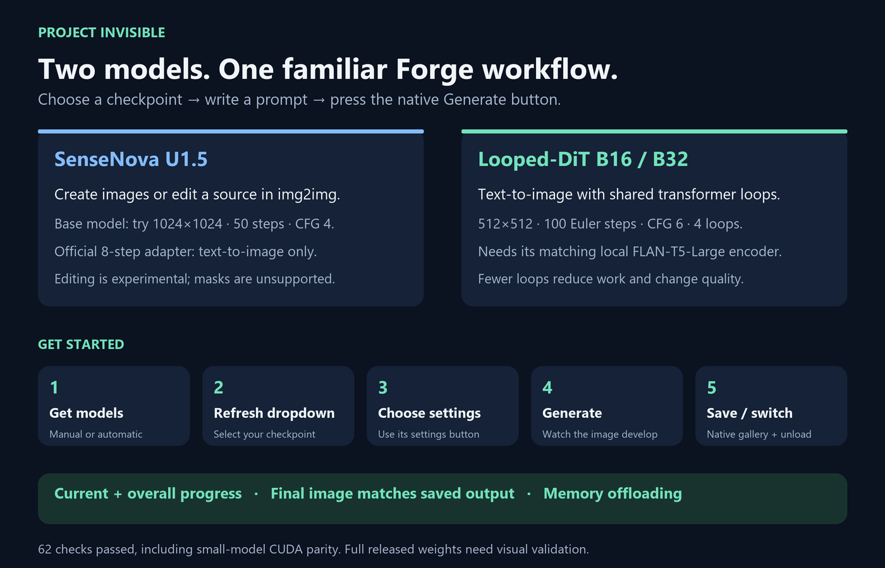
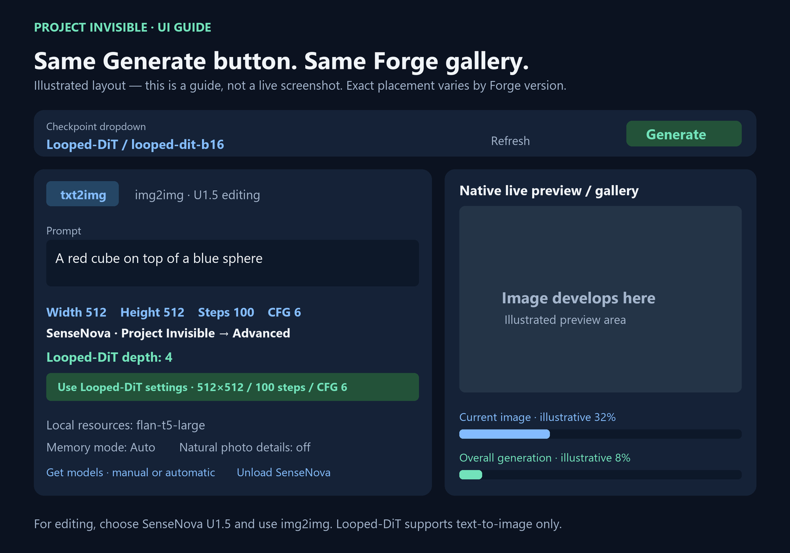

# Project Invisible — SenseNova U1.5 and Looped-DiT for Forge Neo

Select a SenseNova checkpoint in the normal Forge dropdown and press the
normal Generate button. No discarded Stable Diffusion pass, second app,
package upgrades or changes to Forge core.

## Install

The UI image is an illustrated guide; placement varies by Forge version.
Editable SVG versions are in [`docs/assets`](docs/assets).

1. Download this repository using **Code → Download ZIP**.
2. Extract it into Forge Neo’s `extensions` folder. Keep only one SenseNova extension installed.
3. Fully restart Forge. Choose the `sensenova` preset and your SenseNova checkpoint.
4. Open **Get models · manual or automatic** for model links or an optional download. Weights are not included.

The runtime source is bundled. Startup does not upgrade your Python packages.
Requires a compatible Forge Neo environment and NVIDIA CUDA GPU. Image editing is experimental.

## Start

Fully restart Forge. Choose the native `sensenova` UI preset, then your
SenseNova checkpoint. For photographs, try **1024×1024, 50 steps, CFG 4, batch 1**
using **Use photo quality settings**. This is slower than the old 30-step preset;
it follows the bundled official U1.5 base-model example and disables the speed adapter.
Use ordinary prompts; `Natural photo treatment` optionally adds visible
instructions for skin texture, realistic materials and restrained lighting.
It starts enabled for your photography preference; turn it off for artwork or
when you want exact raw prompt wording.
It does not retouch faces or guarantee every image will look photographic.

The normal width/height are respected (multiples of 32). The extension never
changes 1024 to 2048 or retries at a lower resolution after an OOM. 2048 is
closer to the published training buckets but costs substantially more work.

Put weights in `models/Stable-diffusion`; subfolders work. Keep matching
config/tokenizer files in the checkpoint's folder or its `SenseNova-resources`
subfolder. You can explicitly choose a resources folder in Advanced.
Complete HF snapshots also appear in the normal dropdown.

Open **Get models · manual or automatic** to choose the official U1.5 model or
community Q8 GGUF. Manual download is the default. Automatic download begins only
after you click **Download selected model**; it also retrieves GGUF resources when
needed. Existing files are kept. Refresh the checkpoint dropdown after downloading.

## Controls

### Looped-DiT B16 / B32

Added October 6, 2026. Runtime pinned at `65a7705ad2954fa127721bd1131ea8f865688848`.
62 regression checks passed, including exact CPU Euler parity and exact CUDA
BF16 parity between the upstream sampler and our block-streamed sampler using
a small randomly initialized real LoopedMMDiT. Full released model weights were
not downloaded for this validation.

Choose either official Looped-DiT checkpoint from **Get models · manual or automatic**.
Place `looped-dit-b16.pt` or `looped-dit-b32.pt` in `models/Stable-diffusion`.
Place the complete `google/flan-t5-large` encoder/tokenizer in the sibling
`flan-t5-large` folder, or select its local folder in Advanced. Automatic setup
downloads both components only when requested. Generation uses local files only.
Refresh checkpoints, select Looped-DiT, then use **Use Looped-DiT settings**:
**512×512, 100 Euler steps, CFG 6, loop depth 4**. Lower loop depths reduce work;
image quality changes. Both B16 and B32 use the same native Generate, gallery,
batch saving, previews, current/overall progress bars and unload controls.

This is a separate pixel-space architecture, not a U1.5 upgrade or LoRA.
Its shared middle blocks, self-modulating attention and trained weights come
from the official MIT runtime. No separate VAE is used. Image editing, U1.5
speed adapters, Think mode and arbitrary quantized checkpoints are unsupported
for Looped-DiT. Its training and benchmark tools remain upstream; this extension
adds inference to Forge. Official full-weight visual quality and speed must be
validated on your machine; synthetic runtime tests do not establish either.

The Aikimi SenseNova Studio inspired explicit profile validation and memory
lifecycle checks. Its separate Studio, worker environment and Forge core code
are not installed by this extension. We preserve the native txt2img/img2img flow.

Sources: [Looped-DiT](https://github.com/OpenSenseNova/Looped-DiT),
[Aikimi SenseNova Studio](https://github.com/AiWithYou/aikimi-forge-neo/tree/neo/extensions-builtin/sensenova-u15-studio).

### SenseNova U1.5

- Two progress bars show the current image and the whole batch separately.
  Selecting another checkpoint releases SenseNova's model and tokenizer references
  and clears its unused CUDA cache. During sampling, release waits for the next
  safe cancellation point; shared libraries and other models' memory stay owned
  by Forge.

- **Advanced → DeGrid** optionally reduces tiny repeating 2-pixel grid patterns
  in both txt2img and img2img outputs. It defaults off. Enable it only for visible
  grids; this is not a general realism or sharpening filter. CPU cleanup runs once
  on the final image, skips clean images, and finishes before the processed image
  is saved and displayed as complete. It uses the Apache-2.0 ComfyUI-DeGrid core;
  source revision and license are included in `pi_sensenova/_degrid`.

- Native prompt, negative prompt, Steps, CFG, seed, image dimensions, batch
  size/count and output saving are honored. Batch images run sequentially to
  reduce peak memory. Each complete image is saved immediately.
- Negative prompt becomes an explicit `Avoid:` instruction inside the prompt;
  SenseNova has no separate SD-style negative-conditioning interface.
- Use **txt2img** for new images and **img2img** for all instruction editing.
  Empty img2img requests are rejected instead of silently creating a new image.
  Native img2img source is used for instruction editing. Masked inpainting and
  Hires fix are rejected with guidance. Third-party SD-specific processing
  scripts are not automatically compatible with this different architecture.
- Instruction editing is experimental: both tested INT8 and Q8 portrait edits
  increased contrast excessively. Native denoising strength does not apply to
  instruction editing. Text-to-image is the validated photography workflow.
- The official Euler flow sampler runs. Forge's Sampler/Scheduler selectors
  do not apply. The native progress bar reports image number, steps, percentage
  and ETA; the console shows a sampling bar too. The normal gallery shows the
  actual sample developing from noise, then the final image.
  Enabled previews update at most once per second when a new sampling step is ready,
  with the final frame shown immediately. A step taking longer than one second cannot
  supply a fresh frame each second. Forge's preview-disable settings are honored.
  Preview copies are limited to 512 pixels on the longest side;
  final output keeps its requested resolution and exact sampling computation.
- Normal generation remains full computation. Fast is an explicit official
  adapter path requiring **8 steps and CFG 1–3**. The adapter is applied as a
  removable runtime delta; it never overwrites quantized base weights.
- Model files, resources, memory settings and adapter identity determine cache
  behavior. Switching to another checkpoint releases SenseNova before Forge runs.
- The VAE / Text Encoder selector hides only while a SenseNova checkpoint is
  selected and returns for other models. Forge's native control is not removed.
- The named official adapter in `models/Lora/SenseNova` is found automatically
  when the adapter override is blank; no download is started.

## Compatibility

The bundled runtime is pinned; launching never downloads weights or upgrades
torch/transformers. GGUF parsing is bundled under `vendor/deps`.
GGUF uses diffusers' GGUFLinear/dequantization with local shape-validated loading,
independent of stale optional-dependency probes in the host. Descriptor-tagged INT8 safetensors
use Forge's quantization classes on SenseNova-owned layers only. Unknown
layouts are refused. A filename or dropdown entry is not proof of support.

For packed weights, lower-memory modes use safe synchronous block streaming.
This preserves the exact stored weights and avoids the upstream offloader's
packed-tensor incompatibility. It trades transfer time for a much lower peak.

**Forge Neo stays untouched.** Host interface checks and regression tests
protect normal model calls. An arbitrary future Forge update still requires
testing; incompatible integration must fail clearly. Full restart is required
after updates or removal. See ARCHITECTURE.md and BENCHMARKS.md.

## Tests

Using Forge's Python, run `-B -m unittest discover -s tests -p "test_*.py" -v`.
`tests/gpu_benchmark.py` runs real models and writes images plus measured JSON.
GPU measurements apply to the recorded hardware and settings only.

## Troubleshooting

| Problem | Action |
| --- | --- |
| Missing resources | Select the matching local config/tokenizer folder. |
| Out of memory | Select a lower memory mode or explicitly request smaller dimensions. |
| Too much gloss | Enable Natural photo treatment; describe real lighting/materials and avoid beauty-retouching terms. |
| Fast adapter missing | Select the local official adapter, or turn Fast off. |
| Unsupported Forge interface | Disable the extension and restart; report the exact error with the Forge revision. |
| Model absent | Put it under Stable-diffusion and refresh the checkpoint list. |

Code: Apache-2.0. Model weights retain their upstream licenses. The adapter's
training source is SFT; pairing and image quality must be validated on the
chosen base. No model weights are included in the extension package.

## Special Thanks

- [**OpenSenseNova / Looped-DiT**](https://github.com/OpenSenseNova/Looped-DiT) - official model architecture and MIT inference runtime
- [**AiWithYou / Aikimi Forge Neo**](https://github.com/AiWithYou/aikimi-forge-neo) - SenseNova profile validation and memory lifecycle inspiration

- [**r/sdforall**](https://www.reddit.com/r/sdforall/) - community discussion and testing
- [**r/SECourses**](https://www.reddit.com/r/SECourses/) - community discussion and testing
- [**r/malcolmrey**](https://www.reddit.com/r/malcolmrey/) - community discussion and testing
- [**Haoming02 / sd-webui-forge-classic (neo branch)**](https://github.com/Haoming02/sd-webui-forge-classic/tree/neo) - the Forge Neo tree this extension targets
- [**ComfyUI**](https://github.com/comfyanonymous/ComfyUI) - reference for upstream sampler/scheduler coverage
- The Forge / AUTOMATIC1111 community - for the extension ecosystem this plugs into
